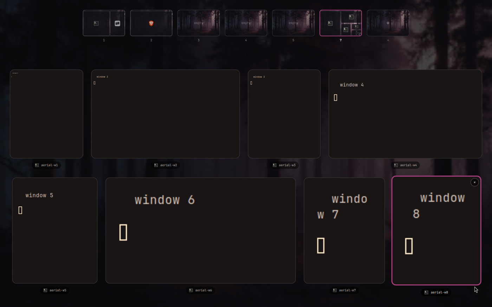

# Aerial

A window overview for [Omarchy](https://omarchy.org), in the shape of macOS's
Mission Control.

Swipe up with three fingers and every window on the workspace spreads out —
live, not as screenshots — with your workspaces along the top. Let go half way
and it goes back. Drop a window onto a workspace to send it there.



## What makes it different

**Type and it narrows.** The fastest way through a window overview is not
aiming at it. Start typing and the spread thins out to what matches, growing
what is left; when one window is standing, enter goes there.

**It follows your fingers.** The swipe isn't a trigger that plays an animation;
the overview is drawn at whatever fraction of the way your fingers have got to.
Stop half way and it sits there. Swipe back down and it returns to the desktop
without ever having "opened". That is the whole difference between this and a
keybinding with a fade on it.

**The thumbnails are the windows.** Each one is a real capture, so a video keeps
playing and a build keeps scrolling while you look for it — refreshed off one
clock about twelve times a second. Not live, deliberately: a texture that
changes every frame makes the compositor redraw the whole overview sixty times a
second, wallpaper and all, and one live thumbnail cost more than twelve-a-second
for all eight put together. Eight windows come to about 6% of one core; leaving
a single one live took it to 43%.

**Nothing to install into the compositor.** No Hyprland plugin to rebuild every
time Hyprland updates. The gesture is registered through Hyprland 0.56's own Lua
API, and the overview is an ordinary Omarchy shell plugin.

**The spread is readable.** Windows keep their own shape — a tall terminal stays
tall, a browser stays wide — and stay in reading order, so the one you want is
roughly where you expect it. Rows are justified like a photo gallery, and each
carries its app's icon, which is what you recognise before you have read
anything.

**The desktops exist before you use them.** Hyprland only creates a workspace
once something is on it, which makes an overview of your desktops useless for
*putting* things somewhere. The strip always offers the first five — the same
rule the bar follows — plus any other in use, and each one is a small picture of
that desktop: its wallpaper, with a block and an icon where every window sits.
Drop a window on an empty one and it is created for you.

## Using it

| | |
|---|---|
| Three fingers up | Open this workspace, following your fingers |
| Four fingers up | Open every window you have, grouped by workspace |
| Three or four fingers down | Close again |
| `SUPER` + `A` | Open or close |
| Just start typing | Narrow the spread to what matches |
| `Enter` | Go to the selected window — or the only one left |
| Arrow keys | Move between windows |
| Click a window | Go to it |
| Hover a workspace | Peek at what is on it, without going there |
| Click a workspace | Go to it |
| Drag a window onto a workspace | Send it there, and stay open |
| Drag a window onto another window | Trade their places in the layout |
| Middle-click, or the ✕ | Close that window |
| `Esc` | Clear what you typed, then close |

Every monitor gets its own overview, spreading its own workspace. The strip
belongs to the screen you swiped on.

## Installing

```bash
git clone https://github.com/ReidenXerx/omarchy-aerial \
  ~/.config/omarchy/plugins/reidenxerx.aerial
omarchy-restart-shell
```

The three-finger gestures work immediately — the plugin registers them with
Hyprland when the shell starts, and again after a config reload.

For the keyboard shortcut, add this to `~/.config/hypr/bindings.lua`:

```lua
o.bind("SUPER + A", "Window overview", "omarchy-shell shell toggle reidenxerx.aerial")
```

## Tuning

How far your fingers travel for a full open is `DISTANCE` at the top of
`app/gesture.lua` — 150, or about a centimetre and a half. Raise it if the
overview opens too eagerly.

`FLICK` next to it is how fast a *short* swipe has to be to open anyway, in
travel per millisecond. A deliberate slow drag measures about 1; a real flick
measures 3 to 4; the threshold sits at 2. Either way
`omarchy-restart-shell` picks up the change.

To give the three-finger gestures back to something else, remove the plugin
directory and restart the shell; the gestures go with it.

## How it works

`app/gesture.lua` registers a three-finger gesture whose `update` callback fires
continuously while your fingers move — about 125 times a second. It turns the
travel into a fraction and emits it on Hyprland's event socket.
`shell/Service.qml` reads that fraction off the socket and assigns it to `t`.

The lift arrives as `finish`, not `end`. A gesture that names the callback `end`
is never told the fingers left, which looks like the overview freezing where you
let go and then jumping a moment later.

Everything else is a function of `t`. Each thumbnail is drawn at
`lerp(where the window really is, where the spread puts it, t)`, so at `t = 0`
the overview is pixel-for-pixel the desktop you were already looking at. That is
why opening does not flash: the picture you have simply starts moving.

`app/Layout.js` decides where a window goes. It is a pure function over plain
rectangles with no QML or compositor in it, so it is tested in node rather than
by looking at it:

```bash
node tests/layout-test.js
```

## Requirements

- Omarchy with its Quickshell-based shell
- Hyprland 0.56 or newer, for the Lua gesture API
- A touchpad, for the part that makes it worth having

## Licence

MIT

## Support

Aerial is free and always will be. If it earns a place in how you use your
desktop, you can support its development at
[donatello.to/DuduPhudu](https://donatello.to/DuduPhudu).
